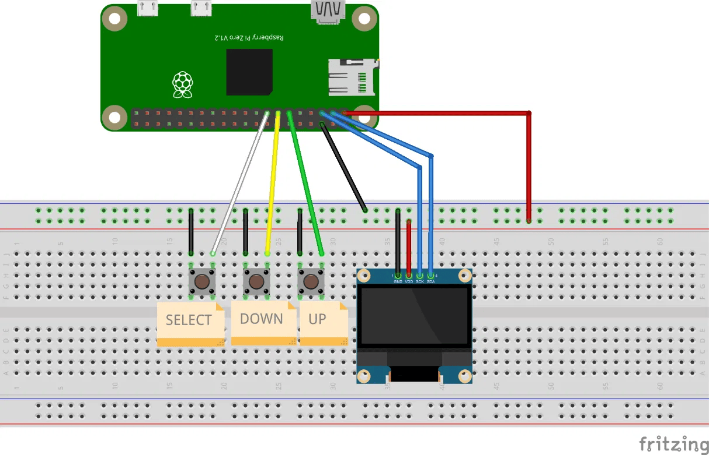

# USB Diagnostic Device

A portable Raspberry Pi Zero WH device that automates diagnostic routines on Linux
machines by presenting itself as a **composite USB peripheral** — a HID keyboard that
types commands, and a mass storage volume that collects the results.

Every script is verified against an RSA signature before a single keystroke is sent.

Final year project for the BSc in Computer, Network and Telecommunications Engineering
at ISEL (Instituto Superior de Engenharia de Lisboa), 2026. Graded 18/20.

---

## The problem

First-line maintenance on industrial servers and network equipment usually means typing
commands into a CLI. That requires knowing the commands, the operating system, and the
right parameters — which makes routine diagnostics dependent on senior technicians and
prone to operator error.

This device moves that knowledge into the hardware. An operator selects a routine from a
physical menu; the device types the commands, collects the output, and reports whether the
run succeeded — with no CLI knowledge required and no drivers to install on the host.

## How it works

1. **Connect.** The device is plugged into a USB port. The host enumerates it as a
   composite peripheral (HID + mass storage + ECM) and the firmware starts automatically.
2. **Select.** The operator navigates the OLED menu with three buttons and picks a routine.
3. **Verify.** The firmware checks the RSA signature of the corresponding script. If the
   check fails, execution aborts — before any key is injected into the host.
4. **Inject.** Commands are typed into the host through the HID interface, using the
   scancode table for the host's keyboard layout.
5. **Collect.** The host writes its output to the mass storage volume. The device reads it
   back offline with `mtools` and reports `SUCCESS`, `ERROR`, or `TAMPERED` on the display.

The ECM interface provides SSH access over USB. It exists for development only and is not
part of the diagnostic flow.

## Security model

The device is functionally the same primitive as commercial BadUSB tools — the USB Rubber
Ducky, Bash Bunny and Flipper Zero were all analysed as prior art. A device that types
arbitrary commands into whatever machine it is plugged into is an attack tool unless
something constrains what it can type. Here, that constraint is script signing.

**Signing (offline, on the Pi, via `prepare_pen.sh`):**
the filename is prepended to the script contents, hashed with SHA-256, and signed with a
passphrase-protected RSA private key. The signature is written to `signatures/<name>.sig`
on the storage image.

**Verification (at runtime, in `scripts.c:verify_signature()`):**
the script and its signature are read from the storage image, the filename is prepended
again, and the signature is checked against the public key held on the Pi — not on the
exposed storage volume. Only on success are keystrokes sent.

Binding the filename into the signed payload is what stops a valid signature being moved
onto a different script.

| Attack | Result |
|---|---|
| Modify a script on the exposed storage area | SHA-256 digest no longer matches → **TAMPERED** |
| Swap in a signature taken from another script | Filename doesn't match the signed payload → **TAMPERED** |
| Forge a new valid signature | Requires the private key, which is passphrase-protected and never present on the exposed volume |
| Replace the verification public key | Not possible in this model — the public key lives on the Pi, outside the exposed volume |
| Direct physical access to the Pi | **Not mitigated.** Accepted residual risk (see Limitations) |

Signature verification guarantees integrity and authenticity. It does not guarantee that a
legitimately signed script is itself safe — that depends on the review process for the
scripts, which is out of scope for this device.

Privileged routines read their credentials from a local vault encrypted with AES-256-CBC
(PBKDF2), managed by `credmgr.sh`.

## Keyboard layouts

The HID interface transmits scancodes, not characters — so the same report produces
different characters depending on the host's keyboard layout. A command typed blind against
the wrong layout produces garbage, or worse, a different command.

The device ships **21 layout tables** (`languages/*.json`, following the USB HID Usage
Tables v1.12) and supports both manual selection and an automatic detection mode that types
a known marker string and checks what the host actually received.

## Hardware

- Raspberry Pi Zero WH (BCM2835, 512 MB RAM), Raspberry Pi OS Lite on a 32 GB microSD
- SSD1306 OLED, 128×64, over I²C at address 0x3C
- Three tactile buttons on GPIO with internal pull-ups and 50 ms software debouncing
- Powered and connected through the USB OTG port (DWC2 controller)



| Component | Signal | GPIO |
|---|---|---|
| OLED SSD1306 | SDA | GPIO 2 |
| OLED SSD1306 | SCL | GPIO 3 |
| Button UP | Input | GPIO 17 |
| Button DOWN | Input | GPIO 27 |
| Button SELECT | Input | GPIO 22 |

## Repository layout

```
files/
  main.c            Entry point, module init, main loop
  button.c/.h       GPIO input with debouncing (pigpio)
  screen.c/.h       SSD1306 driver over I2C
  menu.c/.h         Interface state machine
  scripts.c/.h      Routine execution, signature verification, layout handling
  hid.c/.h          USB keyboard emulation, scancode translation
  creds.c/.h        Encrypted credential vault reader
  languages/        21 keyboard layout tables
  scripts/          Diagnostic shell scripts
  credmgr.sh        Credential vault management
prepare_pen.sh      Builds and signs the mass storage image
```

Roughly 1,700 lines of C, excluding the vendored cJSON library.

## Building

Requires `pigpio`, `openssl` and `mtools` on the Pi.

```bash
cd files
make
```

Produces `menu` (the main application) and `splash` (the boot screen).

Generate a signing keypair and prepare the storage image:

```bash
openssl genrsa -aes256 -out private.pem 2048
openssl rsa -in private.pem -pubout -out public.pem
export SIGNING_PASSPHRASE='...'
sudo -E ./prepare_pen.sh
```

The private key stays on the Pi and is never written to the storage image.

## Results

- Seven diagnostic routines: CPU, RAM, partitions, processes, uptime, system logs, and
  protected files. The last two require sudo credentials from the vault.
- Time from power-on to a usable menu reduced to **21–23 seconds** through systemd boot
  path analysis and service trimming.
- Every recorded run recovered its results file successfully.

## Limitations

Stated plainly, because a security tool that hides its weaknesses is worse than one that
doesn't.

- **Command construction.** `verify_signature()` builds shell commands with `snprintf` and
  `system()`, interpolating the script name. Script names come from a static array compiled
  into the binary, so this is not currently reachable — but making that list dynamic would
  turn it into a command injection vector. It should be rewritten with `execve` and an
  argument vector.
- **Credential handling.** `creds.c` reads decrypted passwords through `popen`, which
  briefly exposes them in process memory and output buffers.
- **Physical access.** An attacker with prolonged physical access to the Pi can read the
  microSD card, including the public key and the encrypted vault. The signing mechanism
  does not defend against this and was never intended to.
- **Validation scope.** Testing was done on a single host: Ubuntu 24.04.4 LTS with a
  Portuguese keyboard layout. The layout detection mechanism was designed to generalise but
  was only validated against that one configuration.
- **Prototype hardware.** Built on a breadboard. Not enclosed, not ruggedised, not tested
  in a real industrial environment.

## Authors

Afonso San Miguel (51792) and João Fatelo (51815).
Supervised by Prof. Tiago Dias and Prof. Pedro Sampaio.

## License

MIT
